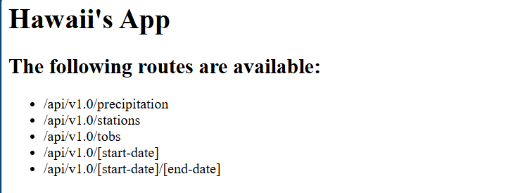

# SQLalchemyChallenge

## Website: 
[website](https://github.com/GuardsGuards/sqlalchemy-challenge)

## Description
Taking a trip to hawaii and studying precipitation and temperature

## Table of Contents
- [Installation](#installation)
- [Usage](#usage)
- [Credits](#credits)
- [License](#license)
- [Features](#features)
- [Tests](#tests)

## Installation
sqlalchemy, python, flask, API

## Usage
used to tudy the climate of hawaii over time

## Credits
Noah

## License
MIT

## Features
generate climate API which provide historical weather information. 

## Tests
confirmation of website from flask
